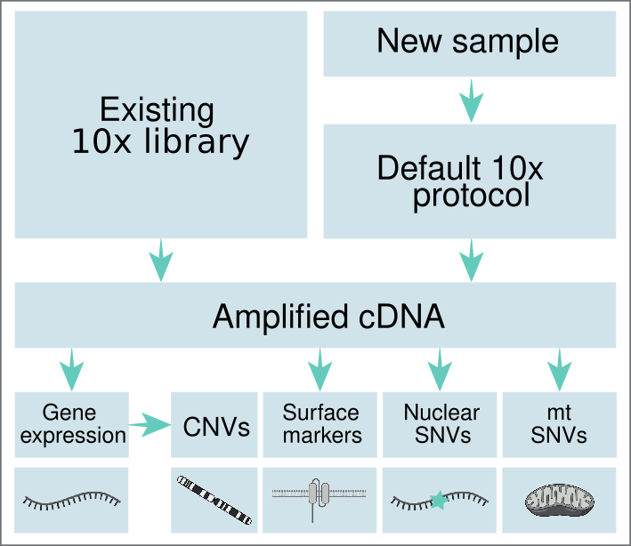

# CloneTracer

CloneTracer is a methdology to add clonal resolution to scRNAseq datasets using nuclear and mitochondrial SNVs as well as CNVs. Coverage in sample-specific nuclear SNVs as well as the mitochondrial genome is increased by generating separate targeted libraries from the whole transcriptome cDNA library. 

  
To analyse the generated data, we have developed a Bayesian model which infers the clonal hierachy of the mutations in the sample and probabilistically assigns cells to clones. All required scripts and detailed explanation on how to implement the model can be found in:

* [Clonal inference](clonal_inference)

In order to increase the coverage on nuclear SNVs a series of nested PCR are carried out on the whole transcriptome library. This requires mutation-specific primers. All necessary scripts to design such primers are available in:

* [Primer design for nuclear SNVs library](primer_design)

Workflows to pre-process the mitochondrial and nuclear SNV libraries can be found in:

* [Processing pipeline nuclear SNV library](library_processing/nuclear-snv)
* [Processing pipeline mitochondrial library](library_processing/mitochondria)

## Contact

All scripts were written by [Sergi Beneyto Calabuig](https://www.crg.eu/en/group-members/sergi-beneyto-calabuig) a member of the [Velten lab](https://www.crg.eu/en/programmes-groups/velten-lab) at the Centre for Genomic Regulation (CRG) in Barcelona. 

In case of problems or doubts about the scripts please [raise an issue](https://github.com/veltenlab/CloneTracer/issues/new).
