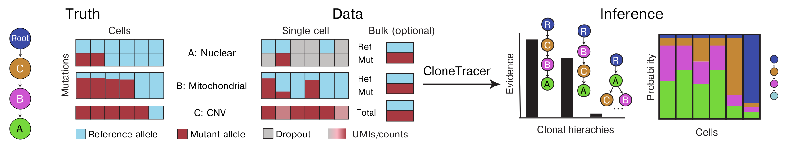

# Inference of clonal hierarchies with CloneTracer


## Description

CloneTracer is a Bayesian model which infer clonal hierarchies from scRNAseq data using nuclear and mitochondrial SNVs as well as CNVs. 
The model uses stochastic variational inference to select the mutation tree with the highest evidence (lowest Evidence Lower Bound, ELBO).
Then it computes the posterior probability for each cell to belong to any given clone in the inferred tree.

<p align="center">

</p>

The model is implemented in [pyro](http://pyro.ai/) a probabilistic programming language written in Python which uses PyTorch as backend.  


## Installation and dependencies


The following python libraries are required to run the model: pyro, pytorch, pickle, pandas, numpy and seaborn. 

We have included a .yml file which contains all required packages to run the model. A conda environment can be created from it to run the model:

```
git clone https://github.com/veltenlab/CloneTracer
cd CloneTracer/clonal_inference
conda env create -f envs/clonetracer.yml -n clonetracer
conda activate clonetracer
```
## Input file

The model requires a config file in JSON format (see below how to create a JSON file in [R](#with-r). Input files for all patients 
in the manuscript are present in [input data](data).

### Required entries

* **M**: matrix of number of cells x number of mutations (rowsxcolumns) with mutant read counts for nuclear and mitochondrial SNVs. For CNVs it should comprise the total counts in the region of interest (e.g. for trisomy in chr8 it will contain all reads from genes in chr8).
* **N**: matrix number of cells x number of mutations (rowsxcolumns) with reference counts for nuclear and mitochondrial SNVs. For CNVs it should contain the total read counts. 
*  **mut_type**: vector of integers indicating the type of mutations (0: CNV, 1: nuclear SNV or 2: mitochondrial SNV)
*  **mut_names**: vector of strings indicating the mutation names
*  **cell_barcode**: vector with cell barcodes. It should match the order of the M and N matrices.


### Optional entries

#### CNVs

* **r_cnv**: required when CNVs are present, vector of indicating whether the CNV is a gain or a loss (1.5 for gain, 0.5 for loss, 0 for SNVs).

#### Bulk data

* **bulk_M**: vector of counts supporting the mutant allele or CNV from bulk data (e.g. exome counts on mutant allele, number of cells with CNV from clinical karyotyping or FISH). In case of more than one sample is present (e.g. different time points, T cells and myeloid cells) a list of vectors should be included.
* **bulk_N**: vector counts supporting the reference allele or diploid data from bulk data (e.g. exome counts on reference allele, number of cells diploid cells from clinical karyotyping or FISH). In case of more than one sample is present (e.g. different time points, T cells and myeloid cells) a list of vectors should be included.

#### Multiple samples

* **class_assign**: zero-indexed vector of integers indicating the class each single cell belongs to. Only required when more than one sample is present in the bulk and single cell data.
* **class_names**: string with names of the different samples

#### Celltype-specific model for CNVs

* **celltype**: zero-indexed vector of integers indicating the cell type of each single cell. Only required when celltype-specific mode is used for CNVs
* **celltype_names**: string with names of the cell types present.
* **cnv_ct_mean**: vector with priors for the fraction of reads on the chromosome with CNV for each cell type. 
* **cnv_ct_sd**: standard deviation of the prior for the fraction of reads on the chromosome with CNVs.

## Run the model

In order to run the model the scripts [run_clonetracer.py](run_clonetracer.py) and [helper_functions.py](helper_functions.py) should be in the same directory. The script run_clonetracer.py is an executable python script with the following arguments:

### Required

* `-i, --input <filename>`: path to the input JSON file with the format described in [Input file](#input-file).
* `-n, --name <text>`: sample name.
* `-o, --output_dir, <filepath>`: path to the output directory

### Optional

* `-t, --number_iterations <integer>`: number of iterations to use in the model inference using SVI. Defaults to 300 for samples with point mutations only and 500 when CNVs are present. 
* `-s, --multiple_samples`: this flag should be added when more than one sample is included in the bulk and single-cell data (e.g. multiple timepoints).
* `-c, -cnv_celltype`: add this flag to run the celltype-specific model for CNVs.
* `-g, -gpu`: include in order to use GPU processor to run the inference model. We recommend to use this option as it results in faster runtimes.
* `-a, --all_trees`: adding this flag will run the model for all possible trees in the sample. We strongly recommend using the default implementation which uses a heuristic approach (see figure S8 of the manuscript)to reduce the tree search space. This results in much faster runtimes than testing all trees yielding identical results.

To run the model for sample A.6, the following command line argument is used:

```
python run_clonetracer.py -i data/A.6.json -n A.6 -o data -t 400 -s -g
```

In [notebooks](notebooks) there are examples of how the model can be run interactively. 

## Output

Two output files are created:

```
* *_out.pickle
* *_tree.pickle
```

In the \*_out.pickle all necessary information to carry out downstream analysis is stored:

* **trees**: list of selected trees by the model (mutationsxclones)
* **mutations_tree**: order of mutations in trees (column names)
* **clonal_prob**: list of matrices with clonal probabilities for each single cell in each selected trees. Rows correspond to cells and columns to clones.
* **cell_barcode**: cell barcodes in the same order as rows in clonal_prob matrices.
* **M**: matrix of mutant read counts.
* **N**: matrix of reference read counts.
* **mutations_matrix**: column names of M and N matrices.
* **ELBO**: ELBO loss for each iteration and tree. In case several trees are selected it can be useful to plot the ELBO for all trees in the last iterations. See [notebooks](notebooks) for detailed analysis and diagnostic plots.

The python class used to run the model is stored in \*_tree.pickle. It can be used to generate diagnostic plots (see [notebooks](notebooks)). 

## Downstream analysis

Downstream analysis was done in R. See [vignette](vignettes) section for example reports for samples A.2 and A.6 from the manuscript. The following packages are required: tidyverse, Seurat, ComplexHeatmap, reticulate, circlize, DigarmmeRsvg, DiagrammeR, qpdf, rsvg, RColorBrewer and archR. 

## How to create a JSON file

### With R 

Entries described in [Input file](#input-file) should be added as items of a list. The following command generates the input file for A.6:

```
library(jsonlite)

# load input files
# single cell count matrices
single_M <- as.matrix(read.csv("data/A.6_files/M.csv")) 
single_N <- as.matrix(read.csv("data/A.6_files/N.csv"))
colnames(single_M) <- colnames(single_N) <- NULL


# bulk exome count matrices 
bulk_M <- as.matrix(read.csv("data/A.6_files/bulk_M.csv"))
bulk_N <- as.matrix(read.csv("data/A.6_files/bulk_N.csv"))
colnames(bulk_M) <- colnames(bulk_N) <- NULL

# cell barcodes
barcodes <- c(read.table("data/A.6_files/barcodes.txt"))$V1

# bulk celltype class
bulk_class <- c(read.table("data/A.6_files/class_bulk.txt"))$V1

# create a list with all required entries
input_A6 <- list(M = single_M,
                 N = single_N, 
                 mut_names = c("RAD21", "X3019.G.C", "X10747.T.C", "X11652.T.C", "X13827.A.G"),
                 cell_barcode = barcodes, 
                 class_assign = bulk_class, 
                 class_names = c("Tcells", "Myeloid"),
                 bulk_M = bulk_M, 
                 bulk_N = bulk_N,
                 r_cnv = rep(0, 5),
                 h_alpha = c(2,1000,1),
                 h_beta = c(100, 1000,1),
                 mut_type = c(1, rep(2, 4)))

# write list as json file
write_json(input_A6, "data/A.6.json")

```
